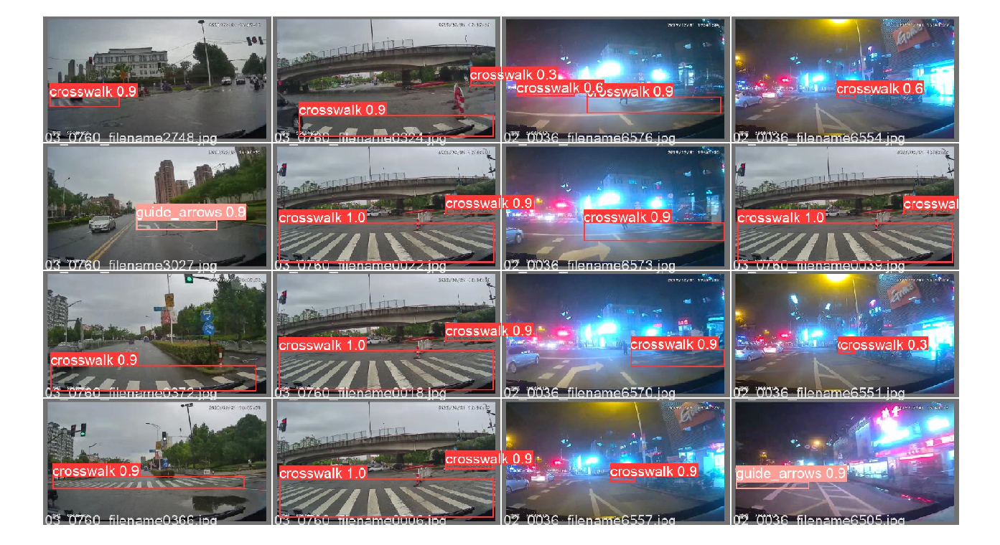

# CDNet-yolov5

《CDNet：一个基于YOLOv5的在Jetson Nano上实时、鲁棒的斑马线检测网络》论文的原生（ultralytics）yolov5训练、推理baseline仓库，CDNet (Crosswalk Detection Network) 是车载摄像头视野下检测斑马线（人行横道）和分析车辆过线行为的具体实现。

> 在这里我们不考虑边缘端的部署优化，在高端设备训练推理。**即该仓库只是在最新的yolov5下训练了原作者的已有的数据集并且提供了训练好的模型**。我们十分感谢原作者的贡献，并感谢他们的创造！

- 原始CDNet论文Paper：[https://rdcu.be/cHuc8](https://rdcu.be/cHuc8)
- 原始CDNet论文Code：[https://github.com/zhangzhengde0225/CDNet](https://github.com/zhangzhengde0225/CDNet)
- 原始CDNet演示Video：[https://www.bilibili.com/video/BV1qf4y1B7BA](https://www.bilibili.com/video/BV1qf4y1B7BA)
- 原始CDNet中文文档：[https://github.com/zhangzhengde0225/CDNet/blob/master/docs/README_zh_cn.md](https://github.com/zhangzhengde0225/CDNet/blob/master/docs/README_zh_cn.md)

# 版本Version

[当前使用的Yolov5版本：V6.1](https://github.com/ultralytics/yolov5/tree/v6.1)


# 数据集Datasets

- 训练集及验证集：3880 [下载(passwd: hul6)](https://pan.baidu.com/s/1jAsQ_kbU7cX0AqK4wDm6LA)
- 测试集：1770  [下载(passwd: vj6b)](https://pan.baidu.com/s/1-AWw2AjE8zTP-iVjOoifOg)
- 类别：crosswalk, guide_arrows

[more](https://github.com/zhangzhengde0225/CDNet/blob/master/docs/DATASETS.md)


# 安装Installation

Clone repo and install requirements.txt in a Python>=3.7.0 environment, including PyTorch>=1.7.
```python
git clone https://github.com/ultralytics/yolov5  # clone
cd yolov5
pip install -r requirements.txt  # install
```

# 训练Train

```python
python train.py --data datasets/data.yaml --cfg models/yolov5n.yaml --weights weights/yolov5n.pt --batch-size 128 --img 640 --epochs 100
                                                       yolov5s                        yolov5s.pt              64                     150
                                                       yolov5m                        yolov5m.pt              40                     300
                                                       yolov5l                        yolov5l.pt              24
                                                       yolov5x                        yolov5x.pt              16
```

# 权重Weights

|Model|Size|mAP(val)@.5:.95|params|Download|
|:-|:-|:-|:-|:-|
|yolov5n|640|0.792|3.65|[exp1/weights](https://github.com/WangRongsheng/CDNet-yolov5/tree/main/runs/train/exp1/weights)|

> Epochs：100 Batch-Size：32 VGPU

# 推理Inference

```python
# 【x】是第几次训练的权重
python detect.py --data datasets/data.yaml --weights runs/train/exp【x】/weights/best.pt --device 0 --source 0  # 摄像头
                                                                                                  cpu   img.jpg  # 图片
                                                                                                        vid.mp4  # 视频
                                                                                                        path/  # directory
                                                                                                        path/*.jpg  # glob
                                                                                                        'https://youtu.be/Zgi9g1ksQHc'  # YouTube
                                                                                                        'rtsp://example.com/media.mp4'  # RTSP, RTMP, HTTP stream
```
# 导出Export

[TFLite, ONNX, CoreML, TensorRT Export](https://github.com/ultralytics/yolov5/issues/251)

# 比较Compare

|推断方式|是否使用GPU|单张图片推断时间|
|:-|:-|:-|
|pytorch|✅|0.010s|
|pytorch||0.083s|
|onnx|-|-|
|tensorRT|-|-|
